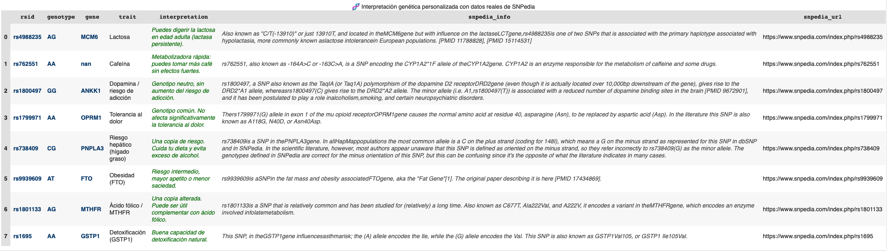

# 🧬 Análisis Genético Personal — Proyecto de Interpretación de SNPs

Este proyecto analiza mis propios datos genéticos crudos (`raw data`) obtenidos a través de un test genético personal, con el objetivo de:

- Aprender análisis de datos aplicados a genética.
- Conectar información genómica con rasgos reales y salud.
- Construir un portfolio técnico con valor científico y personal.

El análisis se ha realizado utilizando Python, Pandas y datos cruzados con la base de conocimiento pública [SNPedia](https://www.snpedia.com).

---

## 🔍 Resultados interpretados

| SNP (`rsid`) | Genotipo | Rasgo asociado             | Interpretación personal |
|--------------|----------|----------------------------|--------------------------|
| [rs4988235](https://www.snpedia.com/index.php/rs4988235) | AG | Lactosa | Puedes digerirla en edad adulta (lactasa persistente). |
| [rs762551](https://www.snpedia.com/index.php/rs762551) | AA | Cafeína | Metabolizadora rápida. |
| [rs1800497](https://www.snpedia.com/index.php/rs1800497) | GG | Dopamina / adicción | Genotipo neutro. Sin aumento de riesgo. |
| [rs1799971](https://www.snpedia.com/index.php/rs1799971) | AA | Tolerancia al dolor | Genotipo común. Sin alteración destacable. |
| [rs738409](https://www.snpedia.com/index.php/rs738409) | CG | Hígado graso | Una copia de riesgo. Conviene cuidar la dieta. |
| [rs9939609](https://www.snpedia.com/index.php/rs9939609) | AT | Obesidad (FTO) | Riesgo intermedio. Mayor apetito. |
| [rs1801133](https://www.snpedia.com/index.php/rs1801133) | AG | Ácido fólico (MTHFR) | Una copia alterada. Puede influir en el metabolismo del folato. |
| [rs1695](https://www.snpedia.com/index.php/rs1695) | AA | Detoxificación | Buena capacidad de detoxificación. |

---

## 🧬 Resultado visual del análisis

---

## 📁 Estructura del proyecto

- `interpretacion_snp_limpio_final.csv`: versión consolidada con mis 8 SNPs, genotipo, gen asociado, interpretación personal y datos de SNPedia.
- `README.md`: este archivo con explicaciones en lenguaje Markdown.
- Análisis realizado en Google Colab.

---

## 🧠 Notas finales

Este análisis no sustituye consejo médico. Está hecho con fines de aprendizaje y desarrollo de habilidades en programación, biología y ciencia de datos.

🔗 [Ver tabla interactiva en HTML](tabla_snp_portfolio.html)
